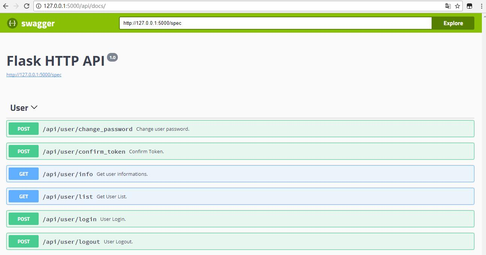

# Flask大型工程模板 - Flask HTTP API 版本

这是一份Flask大型工程的TODO模板。

- 自带基本的用户管理API

使用了swagger生成文档，启动服务器后文档默认路径是：http://127.0.0.1:5000/api/docs/



主要文件及文件夹：

- `compat.py`：Python 2/3 兼容性模块
- `config.py`：Flask App配置文件
- `manage.py`：Flask App管理文件
- `requirements.txt`：Python包依赖文件
- `run_app.sh`：基于Gunicorn启动脚本，主要结合supervisor使用
- `fabfile.py`：Fabric自动化部署文件
- `app文件夹`：存放Flask App代码
    - `api_user文件夹`：有关用户管理的API蓝本
- `deploy文件夹`：存放相关部署配置文件

# 环境参数

- 开发环境：Windows 10 x64
    - IDE：vscode
- 部署环境：Linux/CentOS 7
- Python版本：3.5.4
    - Flask==0.12.0
    - Flask-SQLAlchemy==2.3.2
    - flask-swagger==0.2.13
    - flask-swagger-ui==3.6.0
    - itsdangerous==0.24
    - 其它依赖参见requirements.txt

# 配置过程

## 开发环境的配置

1. 新建Python虚拟环境并安装依赖包

Windows PowerShell：

```
PS > python3 -m venv ./venv
PS > .\venv\Scripts\Activate.ps1
(venv) PS > pip3 install -r requirements.txt
```

Linux：

```sh
$ python3 -m venv ./venv
$ source venv/bin/activate
(venv) $ pip3 install -r requirements.txt
```

2. 创建数据库和管理员

```sh
(venv) > python manage.py db_createfirst
drop the database?[y/n]: n
The database is created successfully!
Please Enter the superuser username:admin
Password:123456
Confirm password:123456
Superuser is created successfully!
```

3. 单独创建管理员

```sh
(venv) > python manage.py createsuperuser
Please Enter the superuser username:admin2
Password:123
Confirm password:123
Superuser is created successfully!
```

3. 启动服务器

```sh
(venv) > python manage.py runserver
```

## 添加自己的业务代码

当需要在本模板基础之上添加自己的业务代码时，有两种方式添加进来:

1. 在app文件夹中添加自己的蓝本，参考资料：http://docs.jinkan.org/docs/flask/blueprints.html
2. 新建一个Flask App，然后使用`werkzeug.wsgi.DispatcherMiddleware`组合，参考资料：http://flask.pocoo.org/docs/0.12/patterns/appdispatch/#app-dispatch

## 部署App

1. 修改`fabfile.py`的主机、用户名等信息
2. 之后可以使用`fab push`命令上传代码，`fab updatedep`更新本地依赖包文件，`fab updateenv`在服务端创建和更新虚拟环境；
3. 自行根据需要，修改deploy文件夹下的文件，再使用`fab`命令自动化部署；


